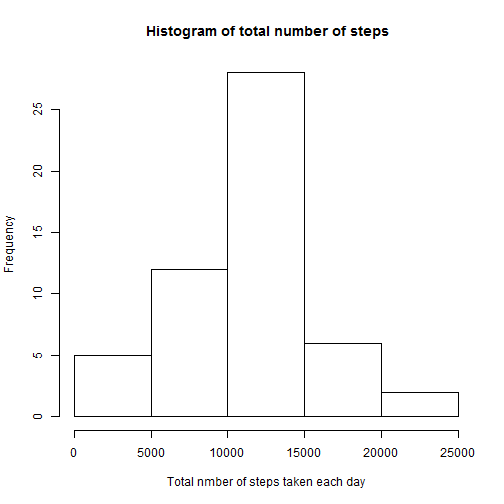
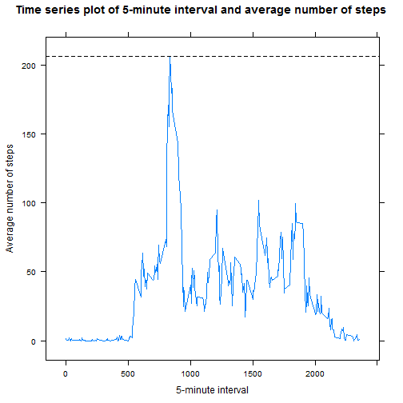
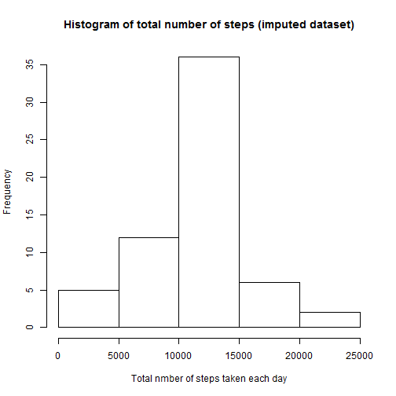
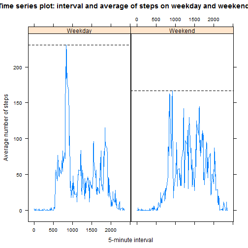

This is the R Markdown document for the Peer Assessment No. 1 of The Reproducible Reseach Course - part of Specialization Certificate on Data Science. 


###Introduction

This assignment makes use of data from a personal activity monitoring device. This device collects data at 5 minute intervals through out the day. 

The data consists of two months of data from an anonymous individual collected during the months of October and November, 2012 and include the number of steps taken in 5 minute intervals each day.

This report describes the multiple parts of assignment. The report answers the questions of assignment and includes the R code used to generate the required output.  

###(1) Loading and preprocessing the data


```r
act_data <- read.csv ("activity.csv")
str (act_data)
```

```
## 'data.frame':	17568 obs. of  3 variables:
##  $ steps   : int  NA NA NA NA NA NA NA NA NA NA ...
##  $ date    : Factor w/ 61 levels "2012-10-01","2012-10-02",..: 1 1 1 1 1 1 1 1 1 1 ...
##  $ interval: int  0 5 10 15 20 25 30 35 40 45 ...
```

```r
summary (act_data)
```

```
##      steps                date          interval     
##  Min.   :  0.00   2012-10-01:  288   Min.   :   0.0  
##  1st Qu.:  0.00   2012-10-02:  288   1st Qu.: 588.8  
##  Median :  0.00   2012-10-03:  288   Median :1177.5  
##  Mean   : 37.38   2012-10-04:  288   Mean   :1177.5  
##  3rd Qu.: 12.00   2012-10-05:  288   3rd Qu.:1766.2  
##  Max.   :806.00   2012-10-06:  288   Max.   :2355.0  
##  NA's   :2304     (Other)   :15840
```

###(2) What is mean total number of steps taken per day?

 Using the aggregate function to generate the total number of steps taken per day:
    

```r
step_total_day <- aggregate(steps ~ date, data=act_data, sum)
step_total_day
```

```
##          date steps
## 1  2012-10-02   126
## 2  2012-10-03 11352
## 3  2012-10-04 12116
## 4  2012-10-05 13294
## 5  2012-10-06 15420
## 6  2012-10-07 11015
## 7  2012-10-09 12811
## 8  2012-10-10  9900
## 9  2012-10-11 10304
## 10 2012-10-12 17382
## 11 2012-10-13 12426
## 12 2012-10-14 15098
## 13 2012-10-15 10139
## 14 2012-10-16 15084
## 15 2012-10-17 13452
## 16 2012-10-18 10056
## 17 2012-10-19 11829
## 18 2012-10-20 10395
## 19 2012-10-21  8821
## 20 2012-10-22 13460
## 21 2012-10-23  8918
## 22 2012-10-24  8355
## 23 2012-10-25  2492
## 24 2012-10-26  6778
## 25 2012-10-27 10119
## 26 2012-10-28 11458
## 27 2012-10-29  5018
## 28 2012-10-30  9819
## 29 2012-10-31 15414
## 30 2012-11-02 10600
## 31 2012-11-03 10571
## 32 2012-11-05 10439
## 33 2012-11-06  8334
## 34 2012-11-07 12883
## 35 2012-11-08  3219
## 36 2012-11-11 12608
## 37 2012-11-12 10765
## 38 2012-11-13  7336
## 39 2012-11-15    41
## 40 2012-11-16  5441
## 41 2012-11-17 14339
## 42 2012-11-18 15110
## 43 2012-11-19  8841
## 44 2012-11-20  4472
## 45 2012-11-21 12787
## 46 2012-11-22 20427
## 47 2012-11-23 21194
## 48 2012-11-24 14478
## 49 2012-11-25 11834
## 50 2012-11-26 11162
## 51 2012-11-27 13646
## 52 2012-11-28 10183
## 53 2012-11-29  7047
```

 The histogram of the total number of steps taken each day:
  

```r
 hist (step_total_day$steps, main = " Histogram of total number of steps", 
       xlab = "Total nmber of steps taken each day")
```

 

 The mean and median of the total number of steps taken per    day:


```r
step_mean <- mean(step_total_day$steps, na.rm = TRUE)
step_median <- median(step_total_day$steps, na.rm = TRUE)
```

 The mean is 1.0766189 &times; 10<sup>4</sup>. The median is 10765.

###(3) What is the average daily activity pattern?

 The time series plot of the 5-minute interval (x-axis) and the average number of steps taken, averaged across all days (y-axis). The plot shows a line at the maximum number of steps corresponding to exact 5-minute interval, on average across all the days in the dataset on x-axis:
  

```r
 library(lattice)
 act_data$interval_factor <- as.factor(act_data$interval)
 int_step_avg <- aggregate(steps ~ interval_factor, data = act_data, mean)
 x <- as.numeric(as.character(int_step_avg$interval_factor))
 y <- int_step_avg$steps
 xyplot(y ~ x, type = "l", tick.number =100, main = "Time series plot of 5-minute interval and average number of steps", 
   xlab = "5-minute interval", ylab = "Average number of steps",  
   panel = function(x, y, ...) {
     panel.xyplot(x, y, ...)  
     panel.abline(h = max(y), lty = 2)  
 })
```

 

###(4) What is impact of Imputing missing values

The following R code calculates and reports the total number of missing values in the dataset (i.e. the total number of rows with NAs):


```r
 sum(!complete.cases(act_data))
```

```
## [1] 2304
```

 Here, a strategy for filling in all of the missing values in the dataset. The strategy use the means for the 5-minute intervals, which shows a new dataset that is equal to the original dataset but with the missing data filled in :
 

```r
 library(dplyr)
```

```
## Warning: package 'dplyr' was built under R version 3.1.2
```

```
## 
## Attaching package: 'dplyr'
## 
## The following object is masked from 'package:stats':
## 
##     filter
## 
## The following objects are masked from 'package:base':
## 
##     intersect, setdiff, setequal, union
```

```r
 act_data_imputed <- group_by(act_data, interval_factor)
 act_data_imputed <- mutate(act_data_imputed, steps = ifelse (is.na(steps), 
                           as.integer(mean(steps, na.rm=TRUE)), 
                           steps))
 head (act_data_imputed, 10)
```

```
## Source: local data frame [10 x 4]
## Groups: interval_factor
## 
##    steps       date interval interval_factor
## 1      1 2012-10-01        0               0
## 2      0 2012-10-01        5               5
## 3      0 2012-10-01       10              10
## 4      0 2012-10-01       15              15
## 5      0 2012-10-01       20              20
## 6      2 2012-10-01       25              25
## 7      0 2012-10-01       30              30
## 8      0 2012-10-01       35              35
## 9      0 2012-10-01       40              40
## 10     1 2012-10-01       45              45
```

 Here, the histogram of the total number of steps taken each day using imputed dataset:
 

```r
 step_total_day_imputed <- aggregate(steps ~ date, data=act_data_imputed, sum)
 hist (step_total_day_imputed$steps, main = "Histogram of total number of steps (imputed dataset)",
       xlab = "Total nmber of steps taken each day")
```

 

 The following R code calculates and reports the mean and median total number of steps taken per day using the imputed dataset:


```r
 step_mean_imputed <- mean(step_total_day_imputed$steps, na.rm = TRUE)
 step_median_imputed <- median(step_total_day_imputed$steps, na.rm = TRUE)
```

 The mean from imputed data set is 1.074977 &times; 10<sup>4</sup>. 
 The median from imputed dataset is 10641.
 
 Clearly, we can notice that these values differ from the estimates from the first part of the assignment. This due to imputing the missing values of some steps.
 
 The impact of imputing missing data on the estimates of the total daily number of steps can be noticed on the improvement of the measures of the values.
 
###(5) Are there differences in activity patterns between weekdays and weekends? 

 The following R code creates a new factor variable in the dataset with two levels – “weekday” and “weekend” indicating whether a given date is a weekday or weekend day using the dataset with the filled-in missing values.It also shows structure of a data frame of the average number of steps taken, averaged across all 5-minute intervals and all weekday days or weekend days created by aggregate function:
  

```r
 act_data_imputed_day <- mutate(act_data_imputed, 
            day = as.factor(ifelse(weekdays(as.Date(date)) == "Saturday" 
                            | weekdays(as.Date(date)) == "Sunday", 
                              "Weekend", "Weekday")))
 int_step_day_avg <- aggregate(steps ~ interval_factor + day, 
                              data = act_data_imputed_day, mean)
 str (int_step_day_avg)
```

```
## 'data.frame':	576 obs. of  3 variables:
##  $ interval_factor: Factor w/ 288 levels "0","5","10","15",..: 1 2 3 4 5 6 7 8 9 10 ...
##  $ day            : Factor w/ 2 levels "Weekday","Weekend": 1 1 1 1 1 1 1 1 1 1 ...
##  $ steps          : num  2.1556 0.4 0.1556 0.1778 0.0889 ...
```

 This last R code shows a panel plot containing a time series plot of the 5-minute interval (x-axis) and the average number of steps taken, averaged across all weekday days or weekend days (y-axis):


```r
 x <- as.numeric(as.character(int_step_day_avg$interval_factor))
 y <- int_step_day_avg$steps
 f <- int_step_day_avg$day
 xyplot(y ~ x | f, type = "l", tick.number =100, main = "Time series plot: interval and average of steps on weekday and weekend", 
   xlab = "5-minute interval", ylab = "Average number of steps", 
       panel = function(x, y, ...) {
          panel.xyplot(x, y, ...)  
          panel.abline(h = max(y), lty = 2)  
   })
```

 

 -End of Report-
 
